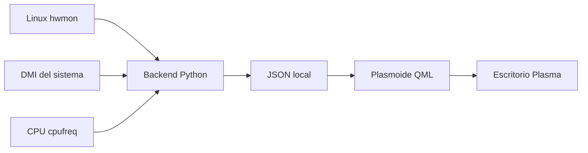

# Plasma Hardware Sensors


Plasmoide para KDE Plasma 6 que muestra temperaturas, frecuencias de núcleos y ventiladores publicados por el subsistema `hwmon` de Linux.

El proyecto nació para un Lenovo ThinkPad T490s, pero el backend detecta sensores de forma dinámica para funcionar en otros equipos siempre que el kernel publique la información correspondiente.

Estado de madurez: beta funcional. La lectura de sensores es local, no requiere privilegios de administrador y no modifica velocidades de ventilador ni valores de `hwmon`.

## Vista previa

<p align="center">
  
</p>

## Funcionalidades

- Temperatura principal de CPU con estado térmico por colores.
- Historial visual de los últimos 60 valores de CPU.
- Temperatura máxima alcanzada durante la sesión del widget.
- Vista desplegable con temperaturas de núcleos y frecuencia en MHz cuando `cpufreq` está disponible.
- Detección dinámica de sensores Intel, AMD, NVMe, ACPI, ThinkPad, Wi-Fi, chipset y GPU cuando aparecen en `hwmon`.
- Lectura de uno o varios ventiladores con velocidad en RPM.
- Identificación local de hostname y modelo DMI.
- Umbrales térmicos basados en valores críticos del sensor cuando el kernel los publica.
- Botones de información por lectura con dispositivo, etiqueta del kernel, entrada `hwmon` y límite crítico cuando existe.
- Interfaz QML integrada con tema, tipografía e iconos de Plasma.

## Arquitectura



| Capa | Tecnología | Responsabilidad |
|---|---|---|
| Sensores | Linux `hwmon`, DMI y `cpufreq` | Exponer temperaturas, límites, RPM, identidad del equipo y frecuencia de CPU |
| Backend | Python 3 y Bash | Descubrir, clasificar, validar y serializar sensores en JSON |
| Interfaz | QML, Qt 6 y KDE Frameworks 6 | Representar valores, estados, gráfico, filas dinámicas y errores |

## Estructura

```text
plasma-hardware-sensors/
├── .github/
│   ├── ISSUE_TEMPLATE/
│   ├── PULL_REQUEST_TEMPLATE.md
│   └── workflows/ci.yml
├── contents/
│   ├── scripts/
│   │   ├── read-sensors.py
│   │   └── read-sensors.sh
│   └── ui/
│       ├── FanIcon.qml
│       ├── HistoryGraph.qml
│       ├── InfoButton.qml
│       ├── SensorRow.qml
│       └── main.qml
├── docs/screenshot.png
├── scripts/
│   ├── package.sh
│   └── validate.sh
├── tests/
├── CHANGELOG.md
├── CONTRIBUTING.md
├── LICENSE
├── SECURITY.md
├── metadata.json
└── pyproject.toml
```

## Compatibilidad

La disponibilidad depende del hardware, firmware y controladores cargados.

| Componente | Fuente habitual | Estado |
|---|---|---|
| CPU Intel | `coretemp`, `cpufreq` | Temperatura y frecuencia si están publicadas |
| CPU AMD | `k10temp`, `zenpower`, `cpufreq` | Temperatura y frecuencia si están publicadas |
| GPU AMD | `amdgpu` | Compatible si publica `hwmon` |
| GPU NVIDIA | `nouveau` u otros sensores `hwmon` | Compatible si están disponibles |
| NVMe | `nvme` | Compatible |
| Chipset | `pch_*` | Compatible |
| Wi-Fi Intel | `iwlwifi` | Compatible |
| ThinkPad | `thinkpad_acpi` | Temperaturas y RPM cuando el firmware las publica |
| ACPI | `acpitz` | Compatible |
| Otros dispositivos | `hwmon` genérico | Detectables con clasificación genérica |

Algunos equipos no exponen RPM o frecuencia por núcleo. En ese caso el widget muestra los datos disponibles y omite los campos ausentes.

## Requisitos

- Linux con KDE Plasma 6.
- Qt 6 y KDE Frameworks 6.
- Python 3.
- Bash.
- Motor de datos ejecutable de Plasma 5 Support para Plasma 6.
- Sensores disponibles en `/sys/class/hwmon`.

En Debian y derivadas:

```bash
sudo apt install \
  python3 \
  lm-sensors \
  libplasma5support6 \
  qml6-module-org-kde-plasma-plasma5support
```

Para desarrollo y validación local:

```bash
sudo apt install plasma-sdk python3-pytest zip
```

## Uso del backend

Ver el JSON normalizado:

```bash
./contents/scripts/read-sensors.sh | python3 -m json.tool
```

Inspeccionar sensores publicados por el sistema:

```bash
sensors
find -L /sys/class/hwmon -maxdepth 2 -type f -name '*_input' -print
```

Para pruebas o diagnósticos, el backend acepta raíces alternativas:

```bash
PLASMA_HARDWARE_SENSORS_HWMON_ROOT=/tmp/hwmon \
PLASMA_HARDWARE_SENSORS_DMI_ROOT=/tmp/dmi \
PLASMA_HARDWARE_SENSORS_CPU_ROOT=/tmp/cpu \
./contents/scripts/read-sensors.sh
```

## Instalación

Desde la raíz del repositorio:

```bash
kpackagetool6 --type Plasma/Applet --install .
```

Después, añade el widget desde el modo de edición de Plasma buscando **Sensores de hardware**.

Actualizar una instalación existente:

```bash
kpackagetool6 --type Plasma/Applet --upgrade .
```

Desinstalar:

```bash
kpackagetool6 --type Plasma/Applet --remove com.juanbau.hardwaresensors
```

## Desarrollo

Ejecutar sin instalar:

```bash
plasmoidviewer -a .
```

Conservar mensajes de diagnóstico:

```bash
plasmoidviewer -a . 2>&1 | tee /tmp/plasma-hardware-sensors.log
```

Validación completa:

```bash
./scripts/validate.sh
```

El script valida `metadata.json`, compila Python, ejecuta la suite de `pytest`, comprueba que el backend emite JSON válido y ejecuta una comprobación de metadatos con `kpackagetool6` cuando está disponible.

## Pruebas

Ejecutar solo las pruebas:

```bash
python3 -m pytest
```

Las pruebas construyen árboles `hwmon`, DMI y CPU falsos en directorios temporales para cubrir casos reales sin depender del hardware del equipo que ejecuta CI.

## Empaquetado

Generar un paquete local:

```bash
./scripts/package.sh
```

El resultado queda en `dist/`:

```text
dist/plasma-hardware-sensors-0.3.0.plasmoid
dist/plasma-hardware-sensors-0.3.0.plasmoid.sha256
```

Instalar el paquete generado:

```bash
kpackagetool6 --type Plasma/Applet --install dist/plasma-hardware-sensors-0.3.0.plasmoid
```

## Versionado

La versión del plasmoide está en `metadata.json`.

Antes de preparar una release:

```bash
./scripts/validate.sh
./scripts/package.sh
```

No hay publicación automática de releases configurada.

## Resolución de problemas

### El widget no muestra temperaturas

Comprueba primero:

```bash
sensors
./contents/scripts/read-sensors.sh | python3 -m json.tool
```

Si `sensors` tampoco muestra el componente, puede faltar un módulo del kernel o el hardware puede no publicar ese dato.

### No aparecen RPM

No todos los fabricantes exponen RPM mediante `hwmon`:

```bash
find -L /sys/class/hwmon \
  -name 'fan*_input' \
  -print \
  -exec cat {} \;
```

### No aparecen MHz por núcleo

La frecuencia depende de `cpufreq`:

```bash
find /sys/devices/system/cpu \
  -path '*/cpufreq/scaling_cur_freq' \
  -print \
  -exec cat {} \;
```

### El widget no aparece en el selector

Actualiza la instalación y reinicia Plasma:

```bash
kpackagetool6 --type Plasma/Applet --upgrade .
plasmashell --replace &
disown
```

## Seguridad y privacidad

- No utiliza Internet.
- No recopila telemetría.
- No escribe en `hwmon`.
- No cambia velocidades de ventilador.
- No necesita ejecutarse como `root`.
- El hostname y modelo DMI permanecen en la sesión local de Plasma.

Consulta [SECURITY.md](./SECURITY.md) para reportar vulnerabilidades.

## Contribución

Consulta [CONTRIBUTING.md](./CONTRIBUTING.md). Los informes de hardware nuevo son especialmente útiles si incluyen distribución, versión de Plasma, modelo, salida de `sensors` y JSON del backend.

## Licencia

GPL-3.0-or-later. Consulta [LICENSE](./LICENSE).

Copyright © 2026 Juan Bau.
