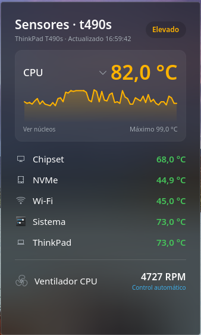
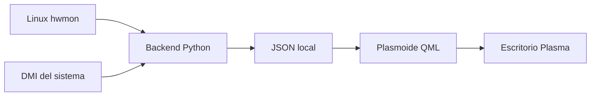

# Sensores de hardware para KDE Plasma


Un plasmoide moderno para supervisar temperaturas y ventiladores directamente desde el escritorio de KDE Plasma 6.

Diseñado originalmente para un Lenovo ThinkPad T490s y evolucionado hacia una detección dinámica de hardware, el widget descubre los sensores publicados por el subsistema `hwmon` de Linux y adapta automáticamente su contenido al equipo donde se ejecuta.

> Compatible con sesiones Plasma sobre Wayland y X11. El servidor gráfico no interviene en la lectura de sensores.

## Características

- Temperatura principal del procesador con estado térmico por colores.
- Gráfico de los últimos 60 valores registrados.
- Temperatura máxima alcanzada durante la sesión del widget.
- Vista desplegable con la temperatura de cada núcleo disponible.
- Detección dinámica de CPU Intel y AMD.
- Compatibilidad con temperaturas de GPU, chipset, NVMe, Wi-Fi, ACPI y firmware del equipo.
- Detección de uno o varios ventiladores con velocidad en RPM.
- Identificación automática del hostname y modelo DMI.
- Límites térmicos calculados a partir de los valores críticos publicados por cada sensor.
- Interfaz integrada con colores, tipografía e iconos del tema activo de Plasma.
- Funcionamiento exclusivamente local, sin conexiones de red ni telemetría.
- Lectura de sensores sin permisos de administrador.

## Vista previa

Guardá una captura del widget en `docs/screenshot.png` para mostrarla aquí:

```markdown

```

## Arquitectura



El proyecto está dividido en tres capas:

| Capa | Tecnología | Responsabilidad |
|---|---|---|
| Sensores | Linux `hwmon` y DMI | Publicar temperaturas, límites críticos, ventiladores e identidad del equipo |
| Backend | Python 3 y Bash | Descubrir, clasificar y normalizar sensores en JSON |
| Interfaz | QML, Qt 6 y KDE Frameworks 6 | Representar valores, estados, gráficos y vistas desplegables |

## Estructura del proyecto

```text
t490s-sensors/
├── metadata.json
├── README.md
└── contents/
    ├── scripts/
    │   ├── read-sensors.py
    │   └── read-sensors.sh
    └── ui/
        ├── FanIcon.qml
        ├── HistoryGraph.qml
        ├── SensorRow.qml
        └── main.qml
```

## Compatibilidad de sensores

La disponibilidad final depende del hardware, el firmware y los controladores cargados por el kernel.

| Componente | Controladores o fuentes habituales | Estado |
|---|---|---|
| CPU Intel | `coretemp` | Compatible |
| CPU AMD | `k10temp`, `zenpower` | Compatible |
| GPU AMD | `amdgpu` | Compatible si el controlador publica `hwmon` |
| GPU NVIDIA | `nouveau` y sensores publicados por el controlador | Compatible si están disponibles |
| NVMe | `nvme` | Compatible |
| Chipset Intel | `pch_*` | Compatible |
| Wi-Fi Intel | `iwlwifi` | Compatible |
| ThinkPad | `thinkpad_acpi` | Temperaturas y RPM cuando el firmware las publica |
| ACPI | `acpitz` | Compatible |
| Otros dispositivos | Interfaz genérica `hwmon` | Detectables; la clasificación puede requerir ampliación |

Algunos fabricantes no publican la velocidad del ventilador en Linux. En esos equipos, el widget puede mostrar temperaturas correctamente aunque las RPM no estén disponibles.

## Requisitos

- Linux con KDE Plasma 6.
- Qt 6 y KDE Frameworks 6.
- Python 3.
- Bash.
- Soporte Plasma 5 Compatibility para el motor de datos ejecutable.
- Sensores expuestos en `/sys/class/hwmon`.

En Debian y distribuciones derivadas, los paquetes relevantes son:

```bash
sudo apt install \
  python3 \
  lm-sensors \
  libplasma5support6 \
  qml6-module-org-kde-plasma-plasma5support
```

Para desarrollar y ejecutar el visor independiente:

```bash
sudo apt install plasma-sdk
```

## Comprobar los sensores disponibles

Antes de instalar el widget, podés verificar qué publica el sistema:

```bash
sensors
```

También podés inspeccionar el JSON normalizado del backend:

```bash
./contents/scripts/read-sensors.sh | python3 -m json.tool
```

## Instalación

Cloná o descargá el proyecto y situate en su directorio raíz:

```bash
cd t490s-sensors
```

Asegurá los permisos de ejecución:

```bash
chmod +x contents/scripts/read-sensors.sh
chmod +x contents/scripts/read-sensors.py
```

Instalá el plasmoide para el usuario actual:

```bash
kpackagetool6 --type Plasma/Applet --install .
```

Después, en el escritorio:

1. Hacé clic derecho y seleccioná **Entrar en modo edición**.
2. Elegí **Añadir elementos gráficos**.
3. Buscá **Sensores de hardware**.
4. Arrastrá el widget al escritorio o al panel.

## Actualización

Después de modificar o descargar una versión nueva:

```bash
kpackagetool6 --type Plasma/Applet --upgrade .
```

Si Plasma mantiene recursos anteriores en memoria, reiniciá únicamente el shell gráfico:

```bash
plasmashell --replace &
disown
```

## Desinstalación

Retirá primero el widget del escritorio y ejecutá:

```bash
kpackagetool6 \
  --type Plasma/Applet \
  --remove com.juanbau.hardwaresensors
```

## Desarrollo

Probá el proyecto sin instalarlo:

```bash
plasmoidviewer -a .
```

Para conservar los mensajes de diagnóstico:

```bash
plasmoidviewer -a . 2>&1 | tee /tmp/hardware-sensors.log
```

El mensaje relacionado con `isScreenUiReady` puede provenir de `plasmoidviewer` en determinadas versiones de Plasma 6 y no necesariamente indica un fallo del widget.

### Flujo de datos

1. `read-sensors.sh` localiza y ejecuta el backend de forma independiente a la ruta de instalación.
2. `read-sensors.py` recorre `/sys/class/hwmon` y consulta DMI.
3. El backend clasifica los dispositivos y genera un único documento JSON.
4. `main.qml` actualiza los valores periódicamente.
5. Las filas se crean dinámicamente según los sensores disponibles.

## Estados térmicos

Cuando un sensor publica un límite crítico, el widget calcula los estados en relación con ese límite:

| Estado | Referencia aproximada |
|---|---:|
| Normal | Más de 25 °C por debajo del límite crítico |
| Elevado | Entre 25 y 15 °C por debajo |
| Alto | Entre 15 y 5 °C por debajo |
| Crítico | A menos de 5 °C del límite crítico |

Si el dispositivo no publica un límite, se aplican umbrales generales conservadores.

Los colores son orientativos y no reemplazan los mecanismos de protección térmica del firmware o del kernel.

## Privacidad y seguridad

- El widget no utiliza Internet.
- No recopila estadísticas ni telemetría.
- No escribe en `hwmon` ni modifica la velocidad del ventilador.
- No necesita ejecutarse como `root`.
- Solamente lee archivos de sensores expuestos por el kernel.
- El nombre y modelo del equipo permanecen en la sesión local de Plasma.

## Resolución de problemas

### El widget no muestra temperaturas

Comprobá primero:

```bash
sensors
./contents/scripts/read-sensors.sh | python3 -m json.tool
```

Si `sensors` tampoco muestra el componente, puede faltar su módulo del kernel o el hardware puede no publicar ese dato.

### No aparecen las RPM

No todos los portátiles y placas base exponen RPM mediante `hwmon`. Verificá:

```bash
find -L /sys/class/hwmon \
  -name 'fan*_input' \
  -print \
  -exec cat {} \;
```

### El widget no aparece en el selector

Actualizá la instalación y reiniciá Plasma:

```bash
kpackagetool6 --type Plasma/Applet --upgrade .
plasmashell --replace &
disown
```

### Verificar el identificador instalado

El identificador actual es:

```text
com.juanbau.hardwaresensors
```

## Hoja de ruta

- Configuración gráfica de intervalos y umbrales.
- Selección de sensores visibles.
- Vista compacta optimizada para el panel.
- Detalle desplegable para NVMe, GPU y otros componentes.
- Históricos independientes por sensor.
- Internacionalización mediante `i18n`.
- Sustitución del motor de compatibilidad por un backend nativo de Plasma 6.
- Empaquetado y publicación en KDE Store.

## Contribuciones

Los informes de hardware nuevo son especialmente útiles. Incluí, cuando sea posible:

- Distribución y versión de Plasma.
- Modelo del equipo.
- Salida de `sensors`.
- JSON generado por `read-sensors.sh`.
- Captura del widget.

Antes de compartir las salidas, revisá si contienen información que prefieras mantener privada, como hostname o modelo del dispositivo.

## Licencia

Este proyecto se distribuye bajo la licencia **GPL-3.0-or-later**.

Copyright © 2026 Juan Bau.
